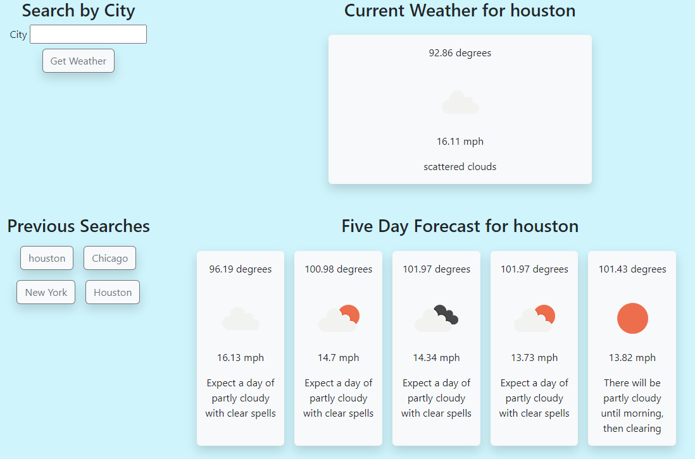

# Weather-App-Five-Day
Five day weather look ahead for a searchable city

## Description 
Users can use this page to check the weather for a given city. Once a city's weather has been searched for, the city will remain as a clickable option on page reload. There is not currently support for specifying a state / country / or zip code. 

## Mockup 

## Links 

https://github.com/Roqieux/Weather-App-Five-Day 

https://roqieux.github.io/Weather-App-Five-Day/

## Usage 
Please see the license in the repo

## Credit 
Credit to Roqieux 
class notes from edx bootcamp 
https://getbootstrap.com/docs/5.3/getting-started/introduction/

